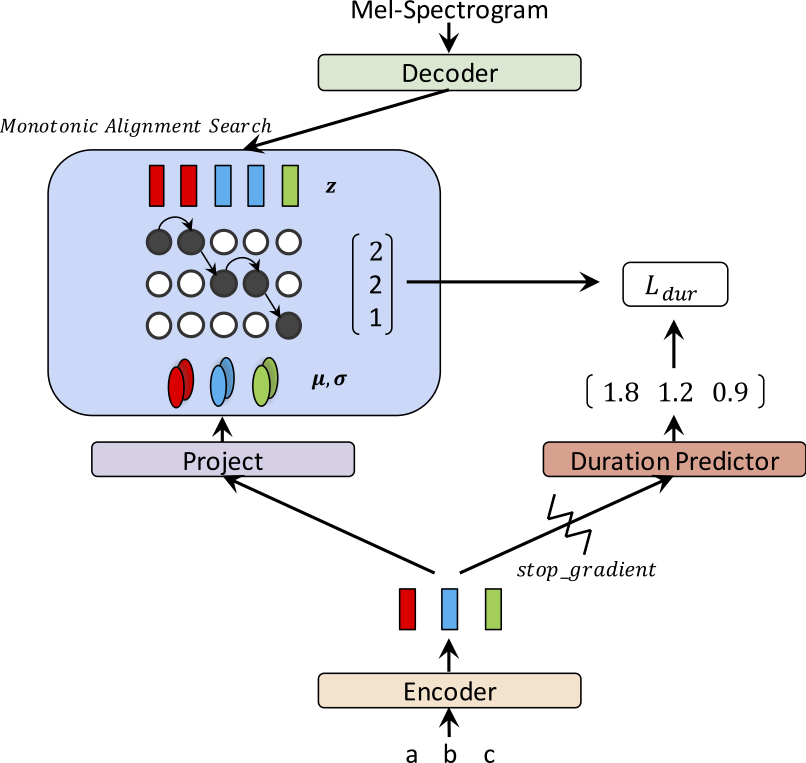
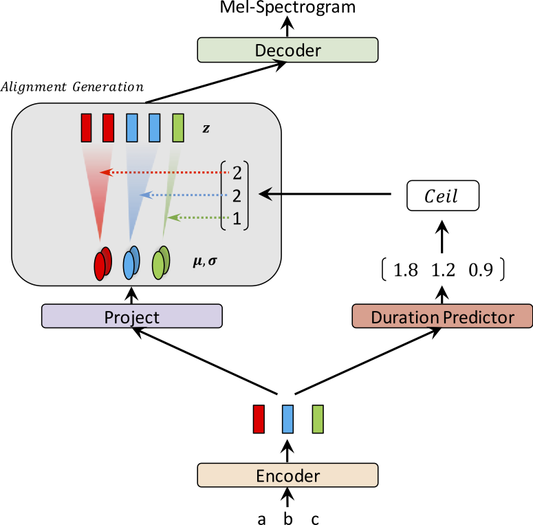

# Glow-TTS: A Generative Flow for Text-to-Speech via Monotonic Alignment Search

### Jaehyeon Kim, Sungwon Kim, Jungil Kong, and Sungroh Yoon

In our recent [paper](https://arxiv.org/abs/2005.11129), we propose Glow-TTS: A Generative Flow for Text-to-Speech via Monotonic Alignment Search.

Recently, text-to-speech (TTS) models such as FastSpeech and ParaNet have been proposed to generate mel-spectrograms from text in parallel. Despite the advantage, the parallel TTS models cannot be trained without guidance from autoregressive TTS models as their external aligners. In this work, we propose Glow-TTS, a flow-based generative model for parallel TTS that does not require any external aligner. By combining the properties of flows and dynamic programming, the proposed model searches for the most probable monotonic alignment between text and the latent representation of speech on its own. We demonstrate that enforcing hard monotonic alignments enables robust TTS, which generalizes to long utterances, and employing generative flows enables fast, diverse, and controllable speech synthesis. Glow-TTS obtains an order-of-magnitude speed-up over the autoregressive model, Tacotron 2, at synthesis with comparable speech quality. We further show that our model can be easily extended to a multi-speaker setting.

Visit our [demo](https://jaywalnut310.github.io/glow-tts-demo/index.html) for audio samples.

We also provide the [pretrained model](https://drive.google.com/open?id=1JiCMBVTG4BMREK8cT3MYck1MgYvwASL0).

<table style="width:100%">
  <tr>
    <th>Glow-TTS at training</th>
    <th>Glow-TTS at inference</th>
  </tr>
  <tr>
    <td></td>
    <td></td>
  </tr>
</table>


## Update Notes*

This result was not included in the paper. Lately, we found that two modifications help to improve the synthesis quality of Glow-TTS.; 1) moving to a vocoder, [HiFi-GAN](https://arxiv.org/abs/2010.05646) to reduce noise, 2) putting a blank token between any two input tokens to improve pronunciation. Specifically, 
we used a fine-tuned vocoder with Tacotron 2 which is provided as a pretrained model in the [HiFi-GAN repo](https://github.com/jik876/hifi-gan). If you're interested, please listen to the samples in our [demo](https://jaywalnut310.github.io/glow-tts-demo/index.html).

For adding a blank token, we provide a [config file](./configs/base_blank.json) and a [pretrained model](https://drive.google.com/open?id=1RxR6JWg6WVBZYb-pIw58hi1XLNb5aHEi). We also provide an inference example [inference_hifigan.ipynb](./inference_hifigan.ipynb). You may need to initialize HiFi-GAN submodule: `git submodule init; git submodule update`


## 1. Environments we use

* Python3.6.9
* pytorch1.2.0
* cython0.29.12
* librosa0.7.1
* numpy1.16.4
* scipy1.3.0

For Mixed-precision training, we use [apex](https://github.com/NVIDIA/apex); commit: 37cdaf4


## 2. Pre-requisites

a) Download and extract the [LJ Speech dataset](https://keithito.com/LJ-Speech-Dataset/), then rename or create a link to the dataset folder: `ln -s /path/to/LJSpeech-1.1/wavs DUMMY`

b) Initialize WaveGlow submodule: `git submodule init; git submodule update`

Don't forget to download pretrained WaveGlow model and place it into the waveglow folder.

c) Build Monotonic Alignment Search Code (Cython): `cd monotonic_align; python setup.py build_ext --inplace`


## 3. Training Example

```sh
sh train_ddi.sh configs/base.json base
```

## 4. Inference Example

See [inference.ipynb](./inference.ipynb)


## Acknowledgements

Our implementation is hugely influenced by the following repos:
* [WaveGlow](https://github.com/NVIDIA/waveglow)
* [Tensor2Tensor](https://github.com/tensorflow/tensor2tensor)
* [Mellotron](https://github.com/NVIDIA/mellotron)
